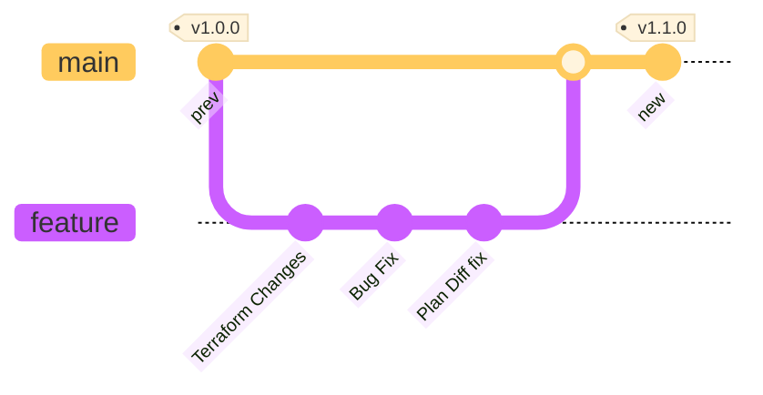
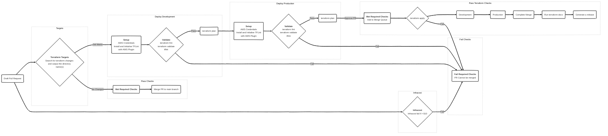

# More Than Certified GitOps MiniCamp 2024

The main purpose of this mini camp is to build a GitOps pipeline to deploy resources, managed by terraform, to AWS using GitHub Actions.

   

## Table of contents

  
Table of contents

   

- [More Than Certified GitOps MiniCamp 2024](#more-than-certified-gitops-minicamp-2024)
  - [Table of contents](#table-of-contents)
  - [Requirements](#requirements)
  - [Workflow](#workflow)
    - [When to apply?](#when-to-apply)
    - [Directories vs Workspaces for multiple environments](#directories-vs-workspaces-for-multiple-environments)
    - [Branching Strategy](#branching-strategy)
    - [Diagram](#diagram)
    - [Workflows](#workflows)
      - [Actions Used](#actions-used)
      - [Infracost](#infracost)
      - [Terraform CI](#terraform-ci)
        - [Targets](#targets)
        - [Validate](#validate)
        - [Plan](#plan)
        - [Apply](#apply)
      - [Enforce All Checks](#enforce-all-checks)
      - [Terraform Docs](#terraform-docs)
      - [Release](#release)
  - [To do list](#to-do-list)
  - [Contributions](#contributions)

## Requirements

  
Expand to see requirements

   

| **Section**             | **Task**                                  | **Self-Reported Status** | **Notes**                                                  |
| :---------------------- | :---------------------------------------- | :----------------------: | :--------------------------------------------------------- |
| **Setup**               |                                           |                          |                                                            |
|                         | Main branch is protected                  |    :white_check_mark:    |                                                            |
|                         | Cannot merge to main with failed checks   |    :white_check_mark:    |                                                            |
|                         | State is stored remotely                  |    :white_check_mark:    |                                                            |
|                         | State Locking mechanism is enabled        |    :white_check_mark:    |                                                            |
| **Design and Code**     |                                           |                          |                                                            |
|                         | Confirm Account Number                    |    :white_check_mark:    | `allowed_account_ids` provider argument                    |
|                         | Confirm Region                            |    :white_check_mark:    | variable validation                                        |
|                         | Add Default Tags                          |    :white_check_mark:    | added to provider block                                    |
|                         | Avoid Hardcoded Values                    |    :white_check_mark:    |                                                            |
|                         | No plaintext credentials                  |    :white_check_mark:    | Environment variables set by OIDC                          |
|                         | Pipeline in GitHub Actions only           |    :white_check_mark:    |                                                            |
| **Validate**            |                                           |                          |                                                            |
|                         | terraform fmt pre-commit hook             |    :white_check_mark:    | Git Hooks managed by trunk-io                              |
|                         | pre-commit hooks are in repo              |    :white_check_mark:    | Git Hooks managed by trunk-io                              |
| **Test and Review**     |                                           |                          |                                                            |
|                         | Pipeline works on every PR                |    :white_check_mark:    | `on: pull_request trigger`                                 |
|                         | Linter                                    |    :white_check_mark:    | TFLint configured with aws plugin and deep check           |
|                         | terraform fmt                             |    :white_check_mark:    | See PR https://github.com/3ware/gitops-2024/pull/5         |
|                         | terraform validate                        |    :white_check_mark:    | See PR https://github.com/3ware/gitops-2024/pull/5         |
|                         | terraform plan                            |    :white_check_mark:    | See PR https://github.com/3ware/gitops-2024/pull/5         |
|                         | Infracost with comment                    |    :white_check_mark:    | See PR https://github.com/3ware/gitops-2024/pull/4         |
|                         | Open Policy Agent fail if cost > $10      |    :white_check_mark:    | See PR https://github.com/3ware/gitops-2024/pull/6         |
| **Deploy**              |                                           |                          |                                                            |
|                         | terraform apply with human intervention   |    :white_check_mark:    | Applied when PR is merged                                  |
|                         | Deploy to production environment          |    :white_check_mark:    | Matrix strategy                                            |
| **Operate and Monitor** |                                           |                          |                                                            |
|                         | Scheduled drift detection                 |    :white_check_mark:    |                                                            |
|                         | Scheduled port accessibility check        |                          |                                                            |
| **Readme**              |                                           |                          |                                                            |
|                         | Organized Structure                       |    :white_check_mark:    |                                                            |
|                         | Explains all workflows                    |    :white_check_mark:    |                                                            |
|                         | Link to docs for each action              |    :white_check_mark:    |                                                            |
|                         | Contribution Instructions                 |                          |                                                            |
|                         | Explains merging strategy                 |    :white_check_mark:    |                                                            |
| **Bonus**               |                                           |                          |                                                            |
|                         | Deploy to multiple environments           |    :white_check_mark:    | See PR https://github.com/3ware/gitops-2024/pull/35        |
|                         | Ignore non-terraform changes              |    :white_check_mark:    | Workflow trigger use paths filter for tf and tfvars files. |
|                         | Comment PR with useful plan information   |    :white_check_mark:    | See PR https://github.com/3ware/gitops-2024/pull/7         |
|                         | Comment PR with useful Linter information |    :white_check_mark:    | See PR https://github.com/3ware/gitops-2024/pull/5         |
|                         | Open an Issue if Drifted                  |    :white_check_mark:    | See Issue https://github.com/3ware/gitops-2024/issues/20   |
|                         | Open an issue if port is inaccessible     |                          |                                                            |
|                         | Comment on PR to apply                    |    :white_check_mark:    | See PR https://github.com/3ware/gitops-2024/pull/32        |

## Workflow

- Create feature branch off main
- Commit change locally and push to remote
- Create a draft pull request that targets the main branch: `gh pr create --draft --base main`

> [!IMPORTANT]
> Pull Requests must be set to draft to prevent CODEOWNER reviewers being assigned until the pull request is ready.
> This cannot be set by default. See [open discussion](https://github.com/orgs/community/discussions/6943).
> Unfortunately this also cannot be automated because action runners, using `GITHUB_TOKEN` for authentication, are unable to run `gh pr ready --undo` as the integration is unavailable. See [open discussion](https://github.com/cli/cli/issues/8910)

- The workflow will run through the tests (fmt, validate, TFLint), then run `terraform plan` and post the plan to the pull request and workflow job summary.
- To approve the plan, approve the pull request and add the pull request to merge queue.

### When to apply?

The [debate rumbles on](https://terramate.io/rethinking-iac/mastering-terraform-workflows-apply-before-merge-vs-apply-after-merge/). The [merge queue](https://docs.github.com/en/repositories/configuring-branches-and-merges-in-your-repository/configuring-pull-request-merges/managing-a-merge-queue) does a pretty good job of addressing this. If `apply` is triggered using the `merge_group` event, the workflow will attempt to apply the plan from the PR and then merge the PR. If the apply fails for any reason, then the PR is not merged.

### Directories vs Workspaces for multiple environments

Another debate. The best argument I have heard for directories was in the Q&A session on 19/10/2024:

> _"anyone should be able to `cd` into a terraform working directory and simply run `terraform plan` without have to worry about workspaces and variable files"_

The workflow uses [changed-files](https://github.com/tj-actions/changed-files) to find the directories containing terraform changes. The output of this job is used to define the matrix strategy for the terraform workflow.

Each directory is mapped to an environment which achieves 2 things:

- Secrets, in the case, the AWS roles, are stored in the [environment](https://docs.github.com/en/actions/managing-workflow-runs-and-deployments/managing-deployments/managing-environments-for-deployment) - not the repository.
- Deployments to production require additional approval.

### Branching Strategy

### Diagram

### Workflows

#### Actions Used

- [changed-files](https://github.com/tj-actions/changed-files)
- [TF-via-PR](https://github.com/OP5dev/TF-via-PR)
- [Infracost](https://github.com/infracost/infracost)
- [Setup Terraform](https://github.com/hashicorp/setup-terraform/commits/main/)
- [Setup TFLint](https://github.com/terraform-linters/setup-tflint)
- [Terraform Docs](https://github.com/terraform-docs/gh-actions)
- [Semantic Release](https://github.com/cycjimmy/semantic-release-action)
- [Wait for Status Checks](https://github.com/poseidon/wait-for-status-checks)

#### Infracost

[Infracost](workflows/infracost.yaml) runs on pull requests when they are opened or synchronized. The workflow generates a cost difference of the resources between the main branch and the proposed changes on the feature branch.

This workflow also flags any policy violations defined in [infracost-policy.rego](../infracost/infracost-policy.rego). See an example in this [pull_request](https://github.com/3ware/gitops-2024/pull/6)

#### Terraform CI

##### Targets

The initial job of the workflow uses [changed-files](https://github.com/tj-actions/changed-files) to output the directories where terraform changes have been made. This output is uses ad the matrix strategy for the deploy job.

##### Validate

Uses a matrix strategy to run in each directory identified in the targets job.

> [!IMPORTANT]
> The strategy has a max-parallel value of 1, which means the jobs are run sequentially.

- Setup AWS credentials using [config-aws-credentials](https://github.com/aws-actions/configure-aws-credentials) using OIDC to assume a role and set the authentication parameters as environment variables on the runner. This step is required when TFLint [deep checking](https://github.com/terraform-linters/tflint-ruleset-aws/blob/master/docs/deep_checking.md) for the AWS rule plugin is enabled.
- Install terraform using [setup-terraform](https://github.com/hashicorp/setup-terraform). _Despite being installed on the runners, `apply` jobs were failing due to version differences between the apply runner and the plan runner_
- Run `terraform fmt`
- Run `terraform init`
- Run `terraform validate`
- Install TFLint using [setup-tflint](https://github.com/terraform-linters/setup-tflint)
- Initialise TFLint to download the AWS plugin rules.
- Run `tflint`
- Update the PR comments if any of the steps fail and exit the workflow on failure.

##### Plan

When the validation steps have succeeded - a ` terraform plan` will be run. The conditional statement runs `plan` on a `pull_request` event. The workflow uses [TF-via-PR](https://github.com/OP5dev/TF-via-PR). This action adds a high level plan and detailed drop down style plan to the workflow summary and updates the pull request with a comment.

##### Apply

After `terraform plan` has been run, assuming the plan is accurate, approve the PR, and click `merge when ready`. This adds the pull request to the merge queue. The conditional statement in the workflow will run `terraform apply` on a `merge_group` event.

#### Enforce All Checks

The only required check for the pull request.

Uses [Wait for Status Checks](https://github.com/poseidon/wait-for-status-checks) to poll the checks API for the status of the other running checks. This helps to overcome the situation where a required check may not run. For example, we could make Terraform CI a required check but, this workflow may not run (so it is skipped) and consequently the required check is not met. This workflow will detect that Terraform CI has been skipped and return an outcome of successful for itself, so the required check passes.

#### Terraform Docs

[Terraform docs](https://github.com/terraform-docs/gh-actions) will run when the pull request is merged. This only needs to run once, following the apply, and not on every commit to a pull request. Updating the README on every commit generates a lot unnecessary commits and you have to pull the updated README prior to the next push to avoid conflicts.

I use my own [Terraform Docs reusable workflow](https://github.com/3ware/workflows/blob/main/.github/workflows/terraform-docs.yaml) which adds job summaries and verified commits to the [terraform-docs gh-action](https://github.com/terraform-docs/gh-actions).

#### Release

Generate a CHANGELOG and version tag using [semantic release](https://github.com/cycjimmy/semantic-release-action)

## To do list

- [ ] Grafana Port Check
- [ ] Fix drift detection for multiple environments

## Contributions

- Special mention to the maintainer of [TF-via-PR](https://github.com/OP5dev/TF-via-PR) for responding to queries quickly and proactively suggesting workflow improvements.
