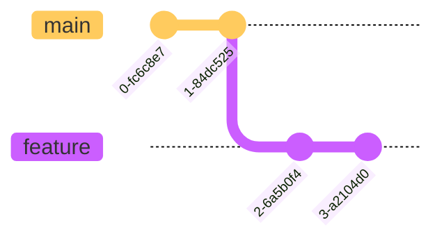

# More Than Certified GitOps MiniCamp 2024

The main purpose of this mini camp is to build a GitOps pipeline to deploy resources, managed by terraform to AWS using GitHub Actions.

   

## Table of contents

- [Requirements](#requirements)
- [Workflow](#workflow)
  - [Branching Strategy](#branching-strategy)
  - [Diagram](#diagram)
  - [Terraform](#terraform)

## Requirements

| **Section**             | **Task**                                  | **Self-Reported Status** | **Notes**                                                                                    |
| ----------------------- | ----------------------------------------- | ------------------------ | -------------------------------------------------------------------------------------------- |
| **Setup**               |                                           |                          |                                                                                              |
|                         | Main branch is protected                  | :white_check_mark:       |                                                                                              |
|                         | Cannot merge to main with failed checks   | :white_check_mark:       |                                                                                              |
|                         | State is stored remotely                  | :white_check_mark:       |                                                                                              |
|                         | State Locking mechanism is enabled        | :white_check_mark:       |                                                                                              |
| **Design and Code**     |                                           |                          |                                                                                              |
|                         | Confirm Account Number                    | :white_check_mark:       | data source post condition                                                                   |
|                         | Confirm Region                            | :white_check_mark:       | variable validation                                                                          |
|                         | Add Default Tags                          | :white_check_mark:       | added to provider block                                                                      |
|                         | Avoid Hardcoded Values                    | :white_check_mark:       |                                                                                              |
|                         | No plaintext credentials                  | :white_check_mark:       | Environment variables set by OIDC                                                            |
|                         | Pipeline in GitHub Actions only           | :white_check_mark:       |                                                                                              |
| **Validate**            |                                           |                          |                                                                                              |
|                         | terraform fmt pre-commit hook             | :white_check_mark:       | Git Hooks managed by [trunk-io](https://docs.trunk.io/cli/getting-started/actions/git-hooks) |
|                         | pre-commit hooks are in repo              | :white_check_mark:       |                                                                                              |
| **Test and Review**     |                                           |                          |                                                                                              |
|                         | Pipeline works on every PR                | :white_check_mark:       | `on: pull_request trigger`                                                                   |
|                         | Linter                                    | :white_check_mark:       | TFLint configured with aws plugin and deep check                                             |
|                         | terraform fmt                             | :white_check_mark:       | https://github.com/3ware/gitops-2024/pull/5                                                  |
|                         | terraform validate                        | :white_check_mark:       | https://github.com/3ware/gitops-2024/pull/5                                                  |
|                         | terraform plan                            | :white_check_mark:       | https://github.com/3ware/gitops-2024/pull/5                                                  |
|                         | Infracost with comment                    | :white_check_mark:       | https://github.com/3ware/gitops-2024/pull/4                                                  |
|                         | Open Policy Agent fail if cost > $10      | :white_check_mark:       | https://github.com/3ware/gitops-2024/pull/6                                                  |
| **Deploy**              |                                           |                          |                                                                                              |
|                         | terraform apply with human intervention   |                          |                                                                                              |
|                         | Deploy to production environment          |                          |                                                                                              |
| **Operate and Monitor** |                                           |                          |                                                                                              |
|                         | Scheduled drift detection                 |                          |                                                                                              |
|                         | Scheduled port accessibility check        |                          |                                                                                              |
| **Readme**              |                                           |                          |                                                                                              |
|                         | Organized Structure                       |                          |                                                                                              |
|                         | Explains all workflows                    |                          |                                                                                              |
|                         | Link to docs for each action              |                          |                                                                                              |
|                         | Contribution Instructions                 |                          |                                                                                              |
|                         | Explains merging strategy                 |                          |                                                                                              |
| **Bonus**               |                                           |                          |                                                                                              |
|                         | Deploy to multiple environments           |                          |                                                                                              |
|                         | Ignore non-terraform changes              | :white_check_mark:       | Workflow trigger use paths filter for tf and tfvars files.                                   |
|                         | Comment PR with useful plan information   | :white_check_mark:       | https://github.com/3ware/gitops-2024/pull/7                                                  |
|                         | Comment PR with useful Linter information | :white_check_mark:       | https://github.com/3ware/gitops-2024/pull/5                                                  |
|                         | Open an Issue if Drifted                  |                          |                                                                                              |
|                         | Open an issue if port is inaccessible     |                          |                                                                                              |
|                         | Comment on PR to apply                    |                          |                                                                                              |

## Workflow

### Branching Strategy

Create feature branch
Commit and push changes
Create a draft pull request - annoying that this cannot be set as the default.

TBC. Currently, feature branch of main.

### Diagram

### Terraform
